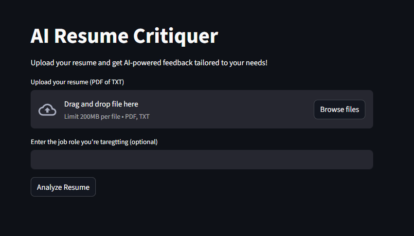

# 📝 AI Resume Critiquer 

[](https://your-app-name.streamlit.app)
[](https://www.python.org/downloads/)


An AI-powered tool that analyzes resumes and provides actionable feedback using NLP and LLMs. Perfect for job seekers!

<div align="center">
  <!-- Replace with your demo GIF -->
  
</div>

## ✨ Key Features

- 🔍 **Grammar & Spelling Check**  
- 📊 **ATS Compliance Scoring**  
- 💡 **Content Improvement Suggestions**  
- 🎯 **Keyword Optimization**  
- 📥 **PDF/DOCX Support**  

---

## 🚀 Quick Start

### Prerequisites
- Python 3.10+
- OpenAI API key (free tier available)

### Installation
```bash
# Clone repo
git clone https://github.com/your-username/resume-critiquer.git
cd resume-critiquer

# Create virtual environment
python -m venv venv
source venv/bin/activate  # Linux/Mac
.\venv\Scripts\activate   # Windows

# Install dependencies
pip install -r requirements.txt